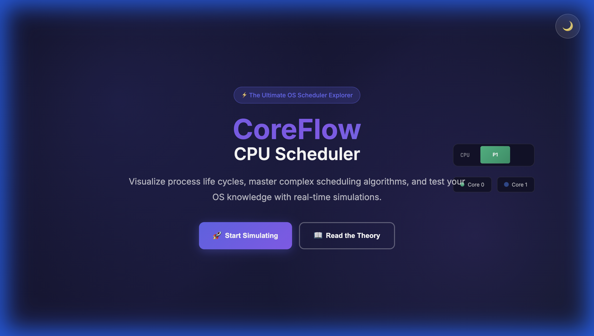
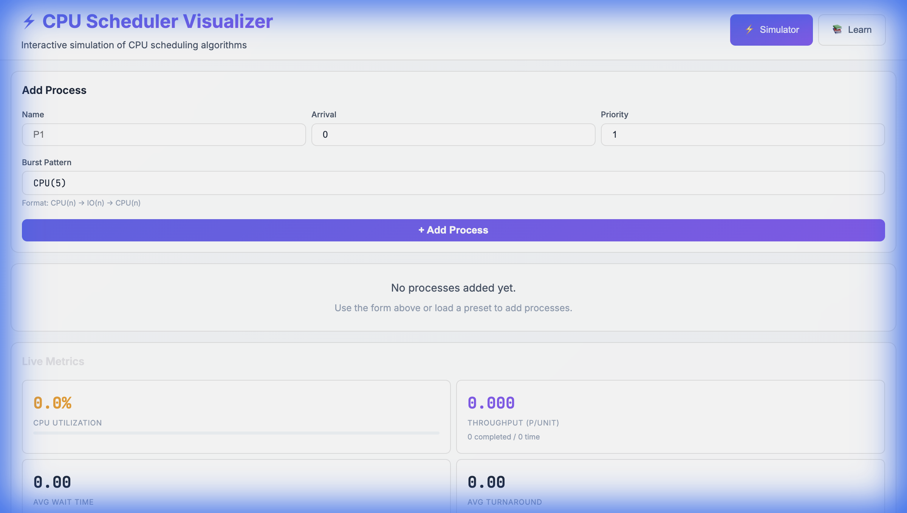
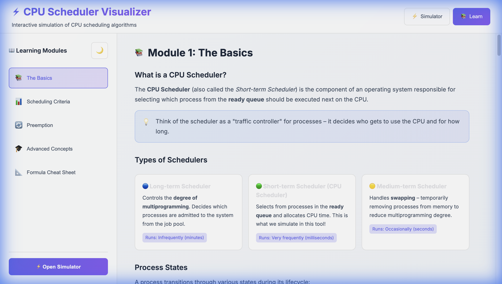
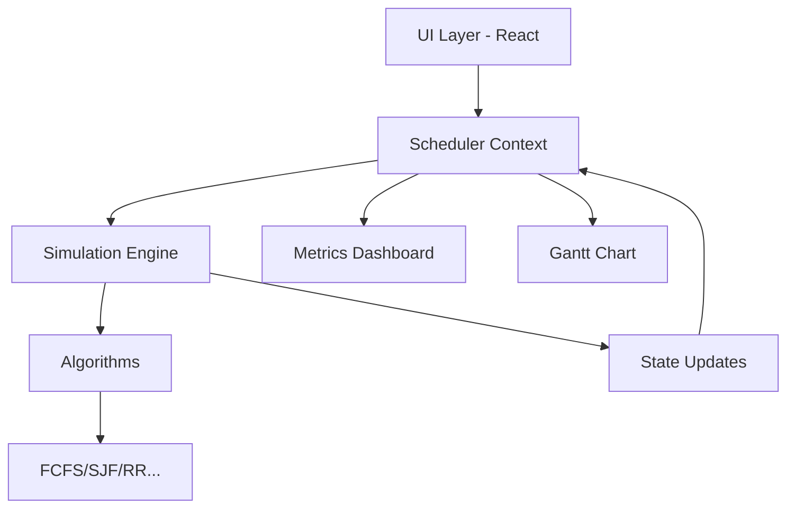

# ⚡ CoreFlow: CPU Scheduler Visualizer


A comprehensive, high-performance CPU scheduling algorithms visualizer and simulator built with **React 19**, **TypeScript**, and **Vite 7**.

[](https://cpu-sechudling-visualiser.vercel.app/)
[](https://www.typescriptlang.org/)
[](https://react.dev/)
[](https://vite.dev/)
[](https://tailwindcss.com/)

> **Master Operating System concepts** by visualizing process life cycles, simulating complex scheduling algorithms, and testing your knowledge with real-time feedback.

---

## 🌟 Visual Guide

````carousel

<!-- slide -->

<!-- slide -->

````

---

## ✨ Features

### 🎮 Scheduling Algorithms
CoreFlow supports 6 industry-standard scheduling algorithms with both preemptive and non-preemptive logic:

| Algorithm | Type | Logic |
|-----------|------|-------------|
| **FCFS** | Non-preemptive | First Come First Serve |
| **SJF** | Non-preemptive | Shortest Job First |
| **SRTF** | Preemptive | Shortest Remaining Time First |
| **Round Robin** | Preemptive | Time quantum based cyclic execution |
| **Priority** | Dual Mode | Preemptive & Non-preemptive handling |
| **MLFQ** | Preemptive | Multi-Level Feedback Queue with dynamic aging |

### 🖥️ Advanced Simulation Engine
- **Multi-Core Architecture**: Toggle between **1, 2, or 4 CPU cores** with **Shortest Queue First** load balancing.
- **I/O Burst Handling**: Realistic `CPU → I/O → CPU` patterns with dedicated wait queue management.
- **Starvation Heat Map**: Visual feedback loop where processes turn red as they wait, highlighting efficiency bottlenecks.
- **Priority Aging**: Automatic mechanism to rescue starving processes by boosting priority over time.
- **Real-time Metrics**: Live calculation of CPU Utilization, Throughput, AWT, ATAT, and Response Time.

### 📝 Interactive Learning & Testing
- **Predict & Verify**: Enter completion time predictions and compare them against the engine's results.
- **Quiz Mode**: Interactive interrupts that ask scheduler-related questions at critical decision points.
- **Learning Hub**: Structured modules covering everything from basic FCFS to complex MLFQ with pro-tips and formula cheat sheets.

---

## 🚀 Quick Start

### Prerequisites
- **Node.js**: 18.x or higher
- **Package Manager**: npm or yarn

### Installation

```bash
# Clone the repository
git clone https://github.com/Pranay0083/CPU-Scheduling-Visualiser.git

# Navigate to project directory
cd CPU-Scheduling-Visualiser

# Install dependencies
npm install

# Start development server
npm run dev
```

The application will be available at [http://localhost:5173](http://localhost:5173).

---

## 🏗️ Architecture

CoreFlow is designed with a clean separation between the simulation engine and the reactive UI layer.



- **`src/engine/`**: Contains the pure logic for scheduling algorithms and state transitions.
- **`src/context/`**: Manages the global state using React Context and `useReducer` for predictable transitions.
- **`src/components/`**: Atomic and molecular components for visualization (Gantt, metrics, logs).

---

## 🎨 UI/UX Highlights

- **Tailwind CSS 4**: Utilizing the latest styling engine for a sleek, modern look.
- **Glassmorphism**: Modern UI components with subtle transparency and blur effects.
- **Responsive Design**: Fully optimized for Desktop and Tablet viewing.
- **Dark/Light Mode**: Seamless theme switching for comfortable long-term usage.

---

## 📄 License

This project is licensed under the [MIT License](LICENSE).

---

<p align="center">
  Built with 💜 for students and OS enthusiasts.
</p>
